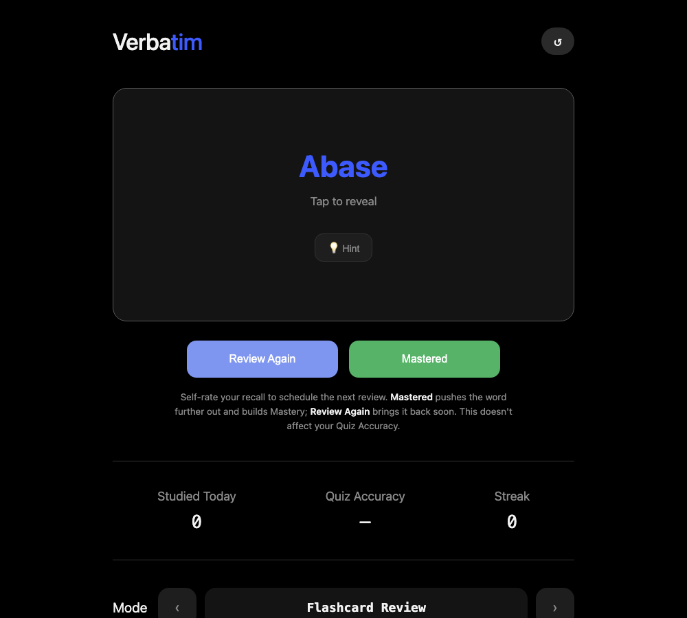

# Verbatim — GRE Vocabulary Builder

A single-user GRE vocabulary trainer with a **Java Spring Boot** backend and a
**React + TypeScript** frontend. The interesting logic lives in Java: a Leitner
spaced-repetition scheduler, smart multiple-choice distractor generation, and
study analytics.



## Features

- **Flashcard review** — tap to reveal the definition; a **Hint** button shows the
  word used in an academic sentence (with the word itself masked) before you reveal.
- **Leitner spaced repetition** — every word lives in one of five boxes. A correct
  answer promotes it and pushes its next review further out (1 → 2 → 4 → 8 → 16 days);
  a wrong answer drops it back to box 1 so it resurfaces immediately.
- **MCQ quiz with smart distractors** — the three wrong options are real GRE words
  whose part of speech and difficulty are as close as possible to the answer, so the
  question can't be solved by elimination.
- **Analytics** — mastery %, overall accuracy, day streak, words seen/mastered, and a
  per-difficulty mastery breakdown.

## Tech stack

| Layer    | Technology                                             |
|----------|--------------------------------------------------------|
| Backend  | Java 21, Spring Boot 4 (Web MVC, Spring Data JPA)      |
| Database | H2, embedded file mode (zero setup)                    |
| Frontend | React 19, TypeScript, Vite                             |

## Getting started

Verbatim runs as **two processes** — the Java API and the web UI — so you'll use
**two terminal windows**. No database to install; it uses an embedded file DB.

### 1. Install the prerequisites

- **JDK 21**
- **Node 20+**

On macOS with [Homebrew](https://brew.sh):

```bash
brew install openjdk@21 node
```

Check they're ready:

```bash
java -version   # should show 21
node -v         # should show v20 or higher
```

### 2. Get the code

```bash
git clone <your-repo-url> verbatim
cd verbatim
```

### 3. Start the backend — Terminal 1

```bash
cd backend
JAVA_HOME=$(/usr/libexec/java_home -v 21) ./mvnw spring-boot:run
```

Wait for the line `Started BackendApplication`. The API is now on
**http://localhost:8080**. On first run it seeds ~360 curated GRE words (a
high-yield subset of the Manhattan Prep 1000 list, enriched with part of speech,
difficulty, and example sentences) into `backend/data/`.

> **Windows / Linux:** if `java -version` already reports 21, you can drop the
> `JAVA_HOME=...` prefix and just run `./mvnw spring-boot:run` (use `mvnw.cmd` on
> Windows).

### 4. Start the frontend — Terminal 2

```bash
cd frontend
npm install        # first time only
npm run dev
```

### 5. Open the app

Go to **http://localhost:5173**. The frontend proxies `/api` calls to the backend
automatically.

> **Reset your progress** anytime with the ↺ button in the top-right of the app.

## Tests

```bash
cd backend && ./mvnw test   # SRS + smart-distractor unit tests
```

## API

| Method | Path                          | Purpose                                  |
|--------|-------------------------------|------------------------------------------|
| GET    | `/api/review/session`         | Words due today (capped at the daily limit) |
| POST   | `/api/review/{wordId}/grade`  | Grade a flashcard `{ "correct": bool }`  |
| GET    | `/api/quiz/next`              | Next MCQ question with smart distractors  |
| POST   | `/api/quiz/{wordId}/answer`   | Answer an MCQ `{ "selectedDefinition" }` |
| GET    | `/api/analytics`              | Study statistics                          |
| POST   | `/api/progress/reset`         | Clear all progress (keeps word content)   |

The daily review cap defaults to 15 and is configurable via `verbatim.daily-limit`
in `backend/src/main/resources/application.properties`.

## Project layout

```
backend/   Spring Boot API — model, repository, service (SRS/quiz/analytics), controller
frontend/  Vite React app — Flashcard, MCQ Quiz, and Analytics modes
```
